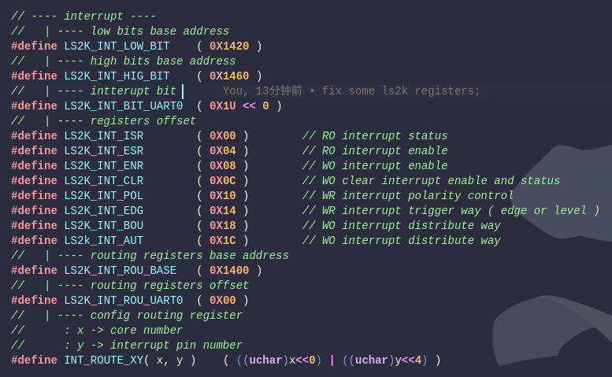

# 从3A5000迁移到2k1000平台的修正记录

`目前迁移尚未完成，仍有部分地址访问错误`

## I. debug串口

根据芯片手册，uart接口挂在APB总线上，APB总线桥挂在PCI总线上，理论上需要读取APB配置头获取BAR的地址，然后根据BAR地址与相关IO地址映射得到真正的uart地址，但是目前没有成功读出APB配置头信息。
查阅StarryOS-loongarch发现qemu-ls2k的debug-uart地址是0x_1fe2_0000。这个地址在本地可以运行成功。

## II. 中断相关

需要参考芯片手册第9章 I/O中断，代码中目前已经修正了中断的初始化，其中的宏定义在memlayout.h中，初始化代码在apic.c文件中。

